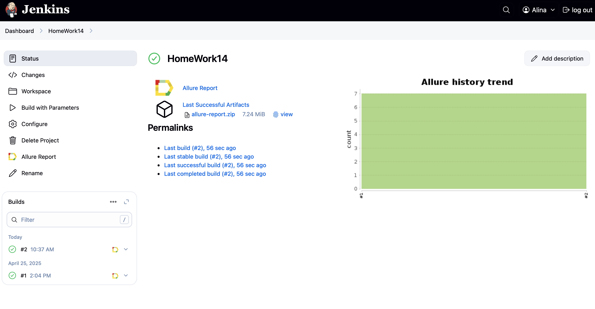

# Проект по автоматизации тестовых сценариев для сайта компании <a href="https://tensor.ru"> 

## 📔 Содержание:

## 🛠 Технологии и инструменты: 

| Java | IntelliJ <br> Idea | GitHub | JUnit <br> 5 | Gradle | Selenide | Selenoid | Alurre <br> Report | Jenkins | Telegram |  
|------|--------------------|--------|--------------|--------|----------|----------|--------------------|---------|----------|
|  |  |  |  |  |  |  |  |  |  |
          
## ☑️ Реализованные проверки:

- Проверка заголовка на главной странице  
- Проверка раздела "О компании"
- Проверка раздела "Разработка ПО"
- Проверка раздела "Работа у нас"
- Проверка вакансии "Тестировщик ПО"
- Проверка раздела "Филиалы"
- Проверка филиала "Москва"

## ▶️ Запуск автотестов

### Запуск тестов из терминала

```bash
gradle clean test
```

### Запуск тестов на удаленном браузере

```bash
-Dbrowser=${BROWSER}
-Dscreen_resolution=${SCREEN_RESOLUTION}
-Dbrowser_version=${BROWSER_VERSION}
```

##  Сборка в [Jenkins](https://jenkins.autotests.cloud/job/HomeWork14/)



### Параметры сборки в Jenkins:
- browser (браузер chrome)
- browser_version (версия браузера 127.0)
- screen_resolution (разрешение экрана 1920x1080)


## Allure Report

### Overview

### Тест-кейсы

## Уведомления в Telegram с использованием бота

## Примеры видео выполнения тестов на Selenoid

